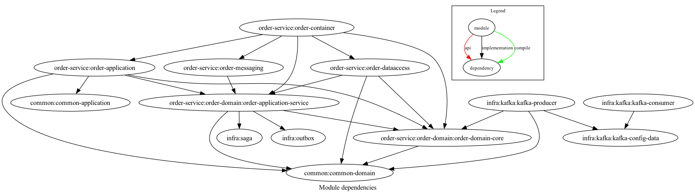

# Ecommerce Application
이커머스 기능(회원, 상품, 주문, 결제, 재고, 배송)을 모듈화하고 

이를 헥사고날 아키텍처로 실제로 코드를 작성해보기 위한 어플리케이션입니다. 

### 2023-09-22
점점 모듈이 많아지고 커질 수록 Common에 의존하게 되는 코드가 작성될 것이다. 코드 중복을 일부 허용하는 것이 복잡하게 얽혀서 분리하기 어려운 것보다 나을 것이라 판단하여 추후 common 모듈을 각각의 서비스 하위에 구현할 예정
